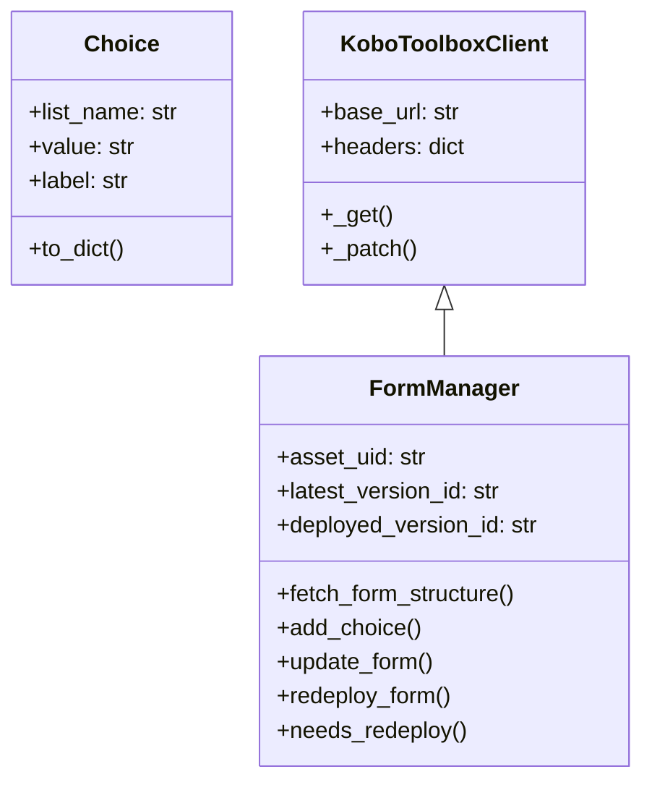

# KoboFormAutomation ✨  
*KoboToolbox Form Management Library*

[](https://www.python.org/)
[](LICENSE)
[](https://github.com/psf/black)

A modern Python interface for managing KoboToolbox survey forms through their REST API. Provides object-oriented abstraction for form versioning, choice management, and deployment operations.

**Key Features**:
- 🏗️ Object-oriented API client architecture
- 📦 Choice management with data validation
- 🔄 Version tracking and deployment control
- 🛡️ Error handling and status checks
- 💡 Separation of update/deploy operations

## 📥 Installation
```bash
git clone https://github.com/juanjuanjuanfer/KoboFormAutomation.git
```

## 📚 Documentation

### 🔧 Configuration

``` python
# Initialize with custom base URL
form = FormManager(
    api_token="your_token",
    asset_uid="your_asset",
    base_url="https://kobo.humanitarianresponse.info/api/v2/"
)
```
### 🔄 Workflow Options

1. Full Automation

```python
form.update_and_redeploy(choice)
```

2. Manual Control
```python
# Update form structure
form.fetch_form_structure()
form.add_choice(new_choice)
form.update_form()

# Later... check and deploy
if form.needs_redeploy():
    form.redeploy_form()
```
## 📊 Class Diagram

## 🔑 Required Parameters

| Parameter   | Description                     | Where to Find |
|-------------|---------------------------------|---------------|
| `api_token` | API authentication token       | KoboToolbox → Account Settings → API |
| `asset_uid` | Unique form identifier         | Form URL → After `/assets/` in path |
| `base_url`  | API endpoint (default provided) | Depends on your KoboToolbox instance |

## 🤝 Contributing

Please, feel free to contribute! :)

## 🙏 Acknowledgments

- **KoboToolbox** for their amazing data collection platform.
- **FHMM** for initial implementation ideas.

## ❓ FAQ

### How do I handle failed redeployments?
Check `form.deployed_version_id` and use `redeploy_form()` with a specific version ID if needed.

### Can I deploy older versions?
Yes! Use:
```python
form.redeploy_form(version_id="vh9JnfrRNwVFjJZnSwRYqd")
```

### What form structure is required?
Currently, it supports forms with a standard choices schema. XLSForm conversion is coming soon!

---
Need help? Open an issue or contact [fercruzjuan2002@gmail.com](mailto:fercruzjuan2002@gmail.com).


---
